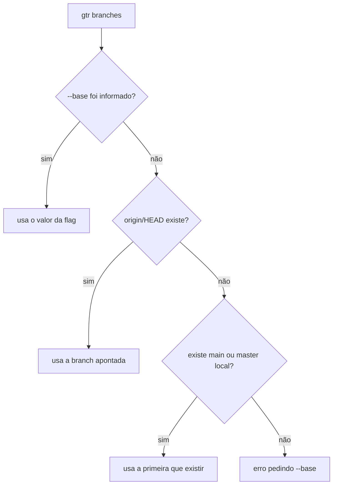

# SRS — branches

- **Data:** 2026-08-05
- **Feature:** `cmd/branches` + `internal/branch`
- **Status:** **entregue** — na `main`
- **Fonte externa:** nenhuma — só o `git` local

---

## 1. Introdução

### 1.1 Propósito

Especificar o comando `gtr branches`, que lista branches locais já mergeadas na branch base e, opcionalmente, as apaga. É a primeira feature entregue do projeto e a que estabeleceu os padrões da solução.

### 1.2 Escopo

- Listagem de branches locais mergeadas na base.
- Flag `--clean` — deleta as listadas, após confirmação.
- Flag `--base` — define a branch base manualmente.
- Flag `--force` — autoriza a deleção das equivalentes (ver [SRS — equivalência por conteúdo](equivalencia.md)).
- Resolução automática da branch base em três níveis.

**Fora de escopo por sequenciamento, não por fronteira:** escrita em ref remota. Local primeiro; a rede chega no **item 7** do roadmap, sob as guardas da **ADR-008** (`RN-04`).

### 1.3 Definições

| Termo | Significado |
|---|---|
| **Branch base** | A branch usada como régua de "já mergeado". Normalmente `main` ou `master`. |
| **Branch mergeada** | Branch local cujo commit de ponta é alcançável a partir da base — todo o trabalho dela já está na base. |
| **Branch protegida** | Branch que o comando nunca oferece para deleção: a base, `main`, `master` e a branch atual. |
| **Porcelain** (categoria) | Comandos git feitos para humano ler (`git branch`). Formato pode mudar entre versões. |
| **Plumbing** | Comandos git feitos para script consumir (`git for-each-ref`). Formato é contrato estável. |

---

## 2. Descrição geral

### 2.1 Posição na arquitetura

```text
internal/git/                 execução de git — não sabe o que é branch
└── Runner (interface), CommandRunner, EnsureRepo

internal/branch/              domínio — não imprime nada
├── branch.go                 Branch
├── base.go                   Base, BaseSource
├── merge_kind.go             MergeKind
├── delete_result.go          DeleteResult
└── repo.go                   Repo: Ensure, ResolveBase, Merged, Delete

cmd/branches.go               front de texto
```

### 2.2 Fluxo

1. Verifica que o diretório atual é um repositório git.
2. Resolve a branch base (`RF-02`).
3. Lista branches locais mergeadas na base e as equivalentes por conteúdo.
4. Remove da lista as branches protegidas.
5. Sem `--clean`: imprime e termina.
6. Com `--clean`: filtra por autorização, pede confirmação e deleta uma a uma, reportando cada resultado.

---

## 3. Requisitos funcionais

### RF-01 — Listar branches mergeadas

`gtr branches` imprime as branches locais cujo trabalho já está contido na branch base, uma por linha, precedidas do nome da base e de como ela foi determinada.

### RF-02 — Resolver a branch base

A base é determinada nesta ordem, parando no primeiro que funcionar:



A saída sempre informa qual caminho foi usado: `informada via --base`, `detectada via origin/HEAD` ou `encontrada localmente`.

### RF-03 — Deletar branches mergeadas

`gtr branches --clean` lista as candidatas, pergunta `Deletar N branches? [y/N]` e, se confirmado, deleta cada uma, reportando sucesso ou falha individual.

### RF-04 — Confirmação com padrão negativo

São aceitos como confirmação: `y`, `yes`, `s`, `sim`, em qualquer caixa. **Qualquer outra entrada, inclusive Enter vazio, cancela.** A comparação é da resposta inteira — `yolo` cancela.

### RF-05 — Definir a base manualmente

`gtr branches --base <branch>` força a base. Se a branch informada não existir localmente, o comando falha com mensagem explícita e código de saída 1. A flag curto-circuita a detecção: nenhuma consulta a `origin/HEAD` é feita.

### RF-06 — Falhas com código de saída

Fora de um repositório git, ou sem base determinável, o comando escreve no `stderr` e sai com código 1. Falha parcial na deleção também sai com 1, depois de tentar todas.

### RF-07 — Segurar branch em uso por outro working tree

Branch em checkout em outro working tree **não entra na lista nem na contagem**. Ela ganha seção própria, com o **caminho** do working tree que a prende e as três formas de soltar:

```text
1 branch em uso por outro working tree, fora da lista:
  presa  ~/projeto-fix

O git recusa apagá-las, mesmo com --force. Para soltar, escolha um:
  git -C <caminho> checkout --detach   solta a branch e preserva o working tree
  git worktree remove <caminho>        apaga o working tree, inclusive arquivos ignorados
  git worktree prune                   quando o diretório já sumiu
```

**O `gtr` não executa nenhuma delas** — **ADR-007**. As três custam coisas diferentes, e escolher por quem roda seria decidir se ele perde o working tree, perde alteração não commitada, ou só move o `HEAD`.

Sem informação de working trees (falha do `git worktree list`), a proteção é **degradada, não fatal**: volta ao comportamento anterior, e a recusa do git no fim continua se explicando sozinha.

---

## 4. Regras de negócio

| ID | Regra |
|---|---|
| **RN-01** | **A fronteira do que pode ser apagado é a lista, não a flag.** `git branch -d` é o caminho padrão e a segunda rede de proteção depois do filtro da aplicação. O `-D` existe atrás de `--force` e só alcança branch que a comparação de patch-id provou já integrada — branch com trabalho pendente nunca é listada, e o que não é listado não é apagado nem com `--force`. A garantia que importa não é "não usar `-D`", e sim **"não destruir trabalho não integrado"**: é ela que sobrevive quando a squashada entra em cena. Esta regra é a instância, em `branches`, da cláusula 1 da **ADR-008**. |
| **RN-02** | **A branch atual nunca é listada.** O git recusa deletar a branch em que se está; oferecê-la seria prometer o que não se pode cumprir. Consequência observável: estando na branch `X`, ela não aparece mesmo estando mergeada. |
| **RN-03** | **`main` e `master` são sempre protegidas**, mesmo quando não são a base. Num repo que tenha as duas, apontar `--base master` não pode colocar a `main` na fila de deleção. |
| **RN-04** | **Escrita em ref remota exige prova, autorização própria e alcance declarado.** Hoje a consulta é restrita a `refs/heads/` e não existe caminho de código que chame `git push --delete` — isso descreve o **estado atual**, não um voto. Branch apagada localmente continua íntegra no servidor. Quando a operação existir, ela obedece a **ADR-008**: só alcança ref cujo conteúdo esteja provado contido na base, atrás de **flag própria** que não se confunde com a do caminho local, e com **cada ref nomeada** na confirmação — porque não há reflog do outro lado e o erro atinge quem não rodou o comando. Ficar de fora hoje é **sequenciamento, não fronteira**: o item 7 do roadmap sempre previu a rede. |
| **RN-05** | **A leitura vem de formato contratual, nunca de saída para humano.** Branches saem de `git for-each-ref refs/heads/`, não de `git branch --merged` — motivo em §6.2. Consequência de segunda ordem: formato contratual não é localizado, então o usuário pode ter `LANG` em qualquer idioma sem quebrar parse nenhum. |
| **RN-06** | **Comandos git rodam sem shell.** `exec.Command` invoca o binário diretamente, sem `sh -c`. Não há injeção de comando nem necessidade de escapar nomes: uma branch chamada `; rm -rf /` chega ao git como argumento literal. |
| **RN-07** | **O erro reportado é o do git, não o do processo.** O `stderr` do git é capturado e propagado. A diferença prática é a CLI dizer `malformed object name main` em vez de `exit status 128`. |
| **RN-08** | **Base ausente é erro, não lista vazia.** A base é verificada antes, para produzir mensagem acionável em vez de erro cru do git. |
| **RN-09** | **Lista vai para `stdout`, erro vai para `stderr`.** A saída normal permanece pipeável (`gtr branches \| grep feat`) sem que mensagens de erro contaminem o pipe. |
| **RN-10** | **Nenhuma linha de saída termina em espaço.** Em colunas alinhadas por `tabwriter`, uma célula final vazia deixa lixo invisível no fim da linha, visível em `grep` e em comparação de saída. |
| **RN-11** | **Nada em `internal/branch` escreve na tela nem lê do teclado.** O domínio devolve dados — `[]Branch`, `[]DeleteResult` — e quem imprime é a apresentação. Vale também para texto de exibição: `BaseSource` é enum, e a frase "detectada via origin/HEAD" é escolhida na apresentação. Detalhe em **ADR-003**. |
| **RN-12** | **Nunca oferecer o que o git não pode cumprir.** `git branch -D` recusa branch presa em worktree **pelo mesmo motivo** que o `-d` — a recusa é absoluta, e nenhuma flag do `gtr` a contorna. Mesmo argumento da `RN-02` para a branch atual. Filtrar preventivamente não é preferência de UX; é a única resposta correta. **Filtrar em silêncio, porém, esconde a informação útil** — daí a seção própria em vez da omissão. |

---

## 5. Interface

```console
$ gtr branches
Base: main (encontrada localmente)

Branches locais já mergeadas (3):
  fix-typo     mergeada
  feat-export  rebaseada
  feat-login   squashada

Use --clean para deletar.
```

| Flag | Padrão | Efeito |
|---|---|---|
| `--clean` | `false` | Deleta as branches listadas, após confirmação |
| `--base <branch>` | vazio | Define a base; vazio aciona a detecção automática |
| `--force` | `false` | Com `--clean`, autoriza `-D` nas squashadas e rebaseadas |

---

## 6. Testes

### 6.1 Cenários executados manualmente

Rodados em repositórios descartáveis, e reexecutados a cada commit do desacoplamento, produzindo saída idêntica — foi o que fez as vezes de teste de regressão antes da suíte existir.

| # | Cenário | Resultado |
|---|---|---|
| 1 | Listagem simples | 3 mergeadas listadas, a não mergeada de fora |
| 2 | `--clean` respondendo `n` | Cancelou, nada apagado |
| 3 | `--clean` com Enter vazio | Cancelou — padrão é negativo |
| 4 | `--clean` respondendo `y` | Apagou as 3, a não mergeada intacta |
| 5 | Rodar com nada a limpar | Mensagem específica, sem erro |
| 6 | Repositório `master`, sem flag | Detectou `master` sozinho |
| 7 | `--base master` explícito | Usou e informou a origem da escolha |
| 8 | `--base` inexistente | Erro claro, saída 1 |
| 9 | Fora de repositório git | Erro claro, saída 1 |
| 10 | Clone real com `origin/HEAD` | Detectou pela via preferencial |
| 11 | Estando dentro de branch mergeada | Não se ofereceu para auto-deletar |
| 12 | HEAD destacado | **Bug encontrado** — ver §6.2 |
| 13 | Dogfooding: apagar a `initialize` com a própria ferramenta | Apagou a local, remota intacta no servidor |
| 14 | Branch presa em worktree, com `--clean` | Deletou as demais, reportou o erro do git na presa, saiu com 1 — `RF-06` e `RN-07` |

### 6.2 O bug do HEAD destacado, e por que a correção não foi filtrar

Com o HEAD destacado, `git branch --merged <base>` inclui na listagem uma linha que não é branch:

```console
(HEAD detached at 64653a4)
antiga
```

Passar essa string para `git branch -d` produz erro confuso e saída 1. **A correção não é filtrar parênteses, e sim trocar o comando por plumbing:** `git for-each-ref refs/heads/ --merged <base>`, que só enumera refs reais e nunca injeta texto descritivo. Efeito colateral positivo: restringir a `refs/heads/` reforça a `RN-04` na origem — a consulta sequer enxerga o espaço de nomes remoto.

### 6.3 Cobertura automatizada

**100% em `internal/branch`.** O pré-requisito foi o `git.Runner` ser interface: um runner falso responde texto fixo e nenhum caso precisa de repositório em disco.

**Cobertura não é evidência suficiente** — 100% mede linha executada, não asserção feita. Mutações deliberadas foram aplicadas para conferir se a suíte reclama; as que sobreviveram viraram teste. Método detalhado em [CONTRIBUTING](../../CONTRIBUTING.md).

---

## 7. Rastreabilidade

| Commit | Entrega |
|---|---|
| `5aa5448` | Módulo Go e esqueleto da CLI — só o wiring |
| `72a457f` | Wrapper interno de git. Marcado `chore` e não `feat` porque não produz efeito visível |
| `2e9b437` | `branches` com `--clean` — a feature completa. `RF-01` a `RF-06` |
| `4dbf517` | Nasce a interface `Runner` e o `CommandRunner` |
| `a323fc0` | `Repo` assume a leitura: `Ensure`, `ResolveBase`, `Merged`. Nascem `Branch`, `Base`, `BaseSource` |
| `2c19c08` | `Delete` devolve `[]DeleteResult`. Sai a última escrita no terminal vinda da lógica — `RN-11` |
| `c556fe8` | `Runner`, `CommandRunner` e `EnsureRepo` saem para `internal/git` |
| `2898bee` | 8 funções, 16 subtestes cobrindo o domínio |
| `b6d48b6` | `deletable(merged, force)` — a decisão de segurança vira função própria |
| `567416b` | Testes do front de texto — `RF-04`, `RN-09`, `RN-10` |
| `5a41f68` | Testes do comando de ponta a ponta contra git roteirizado |

---

## 8. Follow-ups conhecidos

- **Lista de protegidas cravada no código** — `main` e `master` são literais. O arquivo de configuração de **ADR-004** paga isso.
- **Seleção interativa** de *quais* branches apagar, em vez de tudo-ou-nada — **ADR-002**.
